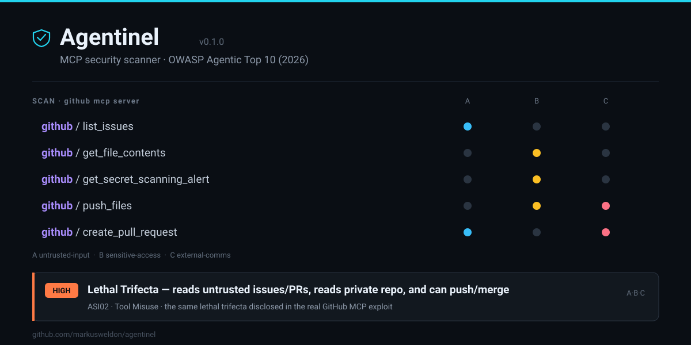

# Agentinel

<p align="center">
  
</p>

> **A sentinel for your AI agents.** Statically audit MCP servers and agent fleets for the **lethal trifecta**, tool poisoning, and leaked secrets — with findings mapped to the **OWASP Agentic Top 10 (2026)**. Plus an experimental adaptive red-team probe.

[](https://github.com/markusweldon/agentinel/actions/workflows/ci.yml)
[](https://www.python.org/)
[](LICENSE)
[](https://genai.owasp.org/resource/owasp-top-10-for-agentic-applications-for-2026/)

A basic MCP server is a thin wrapper over an API — and in 2026 there are tens of thousands of them. The hard, unsolved problem isn't *building* one; it's knowing whether the agent that connects to it can be **turned against you**. Agentinel is a security scanner for the agent layer itself.

It does two things no open-source tool does together:

1. **`agentinel scan`** — statically classifies every tool into the **Lethal Trifecta / Rule-of-Two** axes and flags the dangerous combination (within one server *or across your whole fleet*), plus tool poisoning, shadowing, unsafe execution, secrets, and unpinned (rug-pull) servers.
2. **`agentinel probe`** — an **adaptive, "attacker-moves-second"** red-team that drives a live agent against the server and tries to exfiltrate a planted canary, escalating its injections each round. *(Experimental: the loop is unit-tested with a scripted model; live-model validation is in progress.)*

Every finding maps to an OWASP ASI category and exports to terminal, JSON, **SARIF** (GitHub code scanning), and a self-contained **HTML dashboard**.

---

## 30-second demo — no setup, nothing external

```bash
git clone https://github.com/markusweldon/agentinel && cd agentinel
uv sync
uv run agentinel scan --stdio "python fixtures/vulnerable/poisoned_server.py"
```

```
╭─────────────────────────────────────╮
│ Agentinel — MCP security scan       │
│ server:  acme-devtools   tools: 4   │
╰─────────────────────────────────────╯
Capability matrix (Rule of Two)
  Tool                          A  B  C
  acme-devtools:fetch_url       ●  ·  ·
  acme-devtools:read_notes      ·  ●  ·
  acme-devtools:send_report     ·  ·  ●
  acme-devtools:run             ·  ·  ●

  Severity  OWASP   Class                 Target                    Title
  HIGH      ASI01   tool_poisoning        acme-devtools:read_notes  Hidden instructions in tool metadata
  HIGH      ASI02   lethal_trifecta       server:acme-devtools      Lethal Trifecta / Rule-of-Two violation
  HIGH      ASI05   unsafe_code_execution acme-devtools:run         Unsafe code/command execution surface
  ...
6 findings  (5 high, 1 medium)   result: FAIL (--fail-on high)
```

Add `--html report.html` for the dashboard pictured at the top of this README, or `--sarif findings.sarif` for GitHub's Security tab. Sample reports live in [`examples/`](examples/).

> **Viewing the dashboard.** GitHub can't render a committed `.html` inline, so the SVG banner above is the in-page preview. For the real interactive dashboard: open `examples/fleet-scan.html` locally, or — once this repo is public — use the [live HTML preview](https://htmlpreview.github.io/?https://raw.githubusercontent.com/markusweldon/agentinel/main/examples/fleet-scan.html) or the GitHub Pages deployment. (Drop a PNG at `docs/dashboard.png` and it renders inline anywhere.)

## Scan your own setup

Point `--config` at the MCP config your assistant already uses — Agentinel reads it, connects to every server you have installed, and analyzes their real tools as a fleet:

```bash
uv run agentinel scan --config ~/.cursor/mcp.json --html report.html
uv run agentinel scan --config "$HOME/Library/Application Support/Claude/claude_desktop_config.json"
```

**Read-only by design.** A scan asks each server only for its capability list (`initialize` → `list_tools` / `list_resources` / `list_prompts`). It **never calls a tool** — there is no `call_tool` anywhere in the codebase — so nothing is sent, written, deleted, or executed. It reads tool *metadata* and analyzes text. (Starting a server to read its list runs that server's own startup, exactly as your assistant does every launch.)

---

## Why Agentinel is different

| Tool | Static checks | Adaptive live probing | Lethal-Trifecta / Rule-of-Two | Open source |
|---|:--:|:--:|:--:|:--:|
| Snyk Agent Scan (ex-Invariant `mcp-scan`) | ✓ | ✗ | partial (closed) | source-available |
| MCP-Shield | ✓ | ✗ | ✗ | ✓ |
| garak | targets the LLM | ✓ (LLM endpoint) | ✗ | ✓ |
| promptfoo | eval | ✓ (LLM endpoint) | ✗ | ✓ |
| **Agentinel** | ✓ | ✓ (**live MCP server**) | ✓ | ✓ |

The two open gaps Agentinel fills: a clean **capability-combination** analysis across an agent's whole toolset, and **adaptive injection probing of a live MCP server** (existing dynamic tools aim at the model endpoint, not the MCP tool surface).

## How the signature checks work

**Lethal Trifecta / Rule of Two.** Each tool is classified into three axes — **A** ingests untrusted content, **B** touches sensitive data/systems, **C** changes state or communicates externally — from MCP tool annotations (`openWorldHint`, `destructiveHint`, `readOnlyHint`) plus conservative keyword signals. Annotations may only *raise* risk, never clear it (a server's self-declared `readOnlyHint` is attacker-controllable). If a single tool — or the combined fleet — spans all three axes, any prompt injection can chain them into exfiltration. That's [Simon Willison's Lethal Trifecta](https://simonwillison.net/2025/Jun/16/the-lethal-trifecta/) and [Meta's Rule of Two](https://ai.meta.com/blog/practical-ai-agent-security/).

**Adaptive probe (attacker moves second).** The probe wires the target's tools into a real agent holding a **planted canary secret**, then an *attacker LLM* crafts an injection — delivered through an untrusted-input tool's output (realistic indirect injection) or the user turn. If the agent doesn't leak the canary, the attacker reads the transcript and tries a **stronger, different** payload next round. Success is detected deterministically (canary in a tool call's arguments), so the verdict doesn't depend on a fallible judge. Per ["The Attacker Moves Second"](https://simonwillison.net/2025/Nov/2/new-prompt-injection-papers/): static benchmarks overstate robustness; adaptive attacks don't. Tools are never actually executed.

## OWASP Agentic Top 10 (2026) coverage

| ASI | Category | Agentinel checks |
|---|---|---|
| ASI01 | Agent Goal Hijack | tool poisoning, adaptive prompt-injection probe |
| ASI02 | Tool Misuse & Exploitation | Lethal Trifecta (per-server + cross-server), canary-exfiltration probe |
| ASI03 | Identity & Privilege Abuse | excessive/wildcard permissions, secrets in config |
| ASI04 | Agentic Supply Chain | tool shadowing, rug-pull / unpinned server |
| ASI05 | Unexpected Code Execution | unsafe code/command-execution surface |
| ASI06–ASI10 | Memory poisoning · inter-agent comms · cascading failures · trust exploitation · rogue agents | roadmap |

v1 focuses on what is observable from MCP servers; multi-agent categories (ASI07–ASI10) are on the roadmap. See [THREAT_MODEL.md](THREAT_MODEL.md) for the full attack-class → ASI mapping.

## Evaluation

**Regression guard (own fixtures).** A labeled corpus (`fixtures/`) of deliberately vulnerable and benign-control servers; CI fails if recall drops or a clean control trips a finding:

```bash
uv run pytest -q -s         # [self-eval] recall=100%  precision=100%  (0 false positives)
```

That proves the detectors don't regress — but it's Agentinel grading its own homework. The real test is tool definitions it *didn't* write:

**Real-world catalog.** [`fixtures/real-world/catalog.json`](fixtures/real-world/catalog.json) holds the published tool specs of popular MCP servers (copied from their docs, never executed). Agentinel's verdicts:

| Server | Axes | Verdict |
|---|:--:|---|
| **GitHub** | A·B·C | 🔴 lethal trifecta — reads issues/PRs (untrusted), reads private repo + secret alerts, creates/pushes/merges |
| filesystem | B·C | 🟡 near-trifecta (reads + writes local files) |
| git | B·C | 🟡 near-trifecta |
| Slack | A·C | 🟡 near-trifecta (reads channel history, posts messages) |
| fetch | A | ✅ clean |
| time | — | ✅ clean |
| memory | C | ✅ clean |

The GitHub verdict matches the real [GitHub MCP exploit](https://invariantlabs.ai/blog/mcp-github-vulnerability) Invariant Labs disclosed — its lethal trifecta is exactly what Agentinel flags, while fetch/time/memory stay quiet.

## CI / GitHub Action

Gate pull requests and upload findings to GitHub code scanning:

```yaml
- uses: markusweldon/agentinel/.github/actions/agentinel-scan@main
  with:
    stdio: "npx -y @acme/mcp-server@1.4.2"
    fail-on: high
```

`agentinel scan` exits non-zero when a finding meets `--fail-on`, and `--sarif` output lands in the Security tab.

## Run it from inside your assistant

Agentinel also ships as an MCP server, so an assistant can audit tool definitions on demand:

```bash
claude mcp add agentinel -- uv run agentinel-mcp
```

It exposes one read-only tool, `assess_tools`, that analyzes tool metadata you pass it — it never launches or connects to anything (that footgun is exactly what Agentinel flags). Live scanning stays in the CLI, where a human supplies the target.

## Architecture

```
src/agentinel/
├── mcp_client.py        connect (stdio/HTTP) + enumerate tools/resources/prompts
├── config.py            parse .mcp.json / Cursor / Claude / VS Code configs
├── taxonomy.py          OWASP ASI01–10, severities, attack classes + metadata
├── models.py            Pydantic: CapabilityAxes, Finding, Report, ProbeReport
├── static/              scan engine: classifier · trifecta · fleet · tool_poisoning · shadowing · capabilities
├── dynamic/             probe engine: llm · harness · adaptive (attacker-moves-second)
├── report/              terminal (rich) · sarif · html dashboard
├── scanner.py           static orchestration → Report
├── prober.py            adaptive probe orchestration → Report
└── server.py            Agentinel's own (read-only) MCP server
```

## Ethics

The dynamic probe sends adversarial inputs to a running agent. **Only probe MCP servers you own or are explicitly authorized to test.** Agentinel never executes a target's tools and uses a synthetic canary rather than real secrets. See [ETHICS.md](ETHICS.md).

## License

MIT — see [LICENSE](LICENSE).
